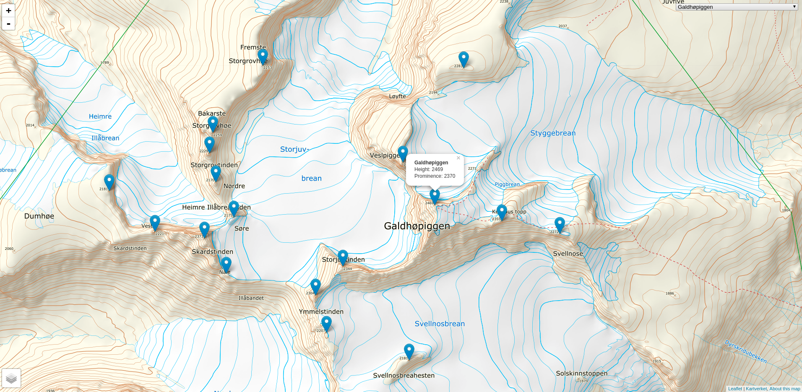

##########################
The 2000 m peaks in Norway
##########################

This is just a small Python script for generating a map of the
2000 m peaks in Norway. The maps are from the
`Norwegian Mapping Authority <https://www.kartverket.no/en/data/Open-and-Free-geospatial-data-from-Norway>`_
and `Leaflet <https://leafletjs.com>`_ is used for rendering the maps.

Example map
===========

